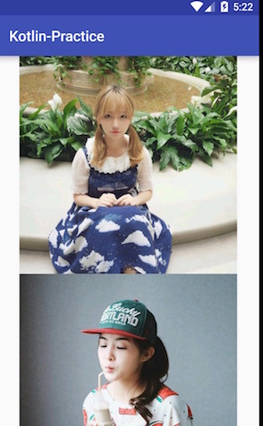

# Kotlin-Android-Practice

[Why Use Kotlin & Kotlin Use Case](http://mio4kon.com/2016/08/30/Why%20use%20Kotlin%20&%20Kotlin%20Use%20Case%20%20/) 

[Kotlin For Android 实践](http://mio4kon.com/2016/08/17/Kotlin%20for%20Android%E5%AE%9E%E8%B7%B5/) 

## 准备

1. 创建一个新工程
2. Android Studio需要安装Kotlin插件(IDEA默认已经安装)
3. command+shift+A在弹出框中输入`Convert Java File to Kotlin File`

做完这三步,你会发现原来生成的java代码转成了Kotlin代码:

```java

class MainActivity : AppCompatActivity() {

    override fun onCreate(savedInstanceState: Bundle?) {
        super.onCreate(savedInstanceState)
        setContentView(R.layout.activity_main)
    }
}
```

现在就可以使用Kotlin作为Android开发的语言了.

## 配置Gradle

准备工作的第三步,除了帮你将java转为Kotlin,还帮你配置了Gradle,如果不想转换原有的java代码,那么需要自己配置Gradle.除了`kotlin-stdlib`这个库,Android开发建议加上**anko-common**这个库.
 
 <!--more-->
 
### 关于Anko 

[Anko](https://github.com/Kotlin/anko)是一个用来简化一些Android任务的很强大的Kotlin库,如果不使用Anko的DSL功能,只需要使用`anko-common`库就行了,它是`Anko`的精简版.
 
 `Project-gradle:`

```groovy

 buildscript {
    ext.kotlin_version = '1.0.3'
    ext.anko_version = '0.8.2'
    repositories {
        jcenter()
    }
    dependencies {
        classpath 'com.android.tools.build:gradle:2.1.2'
        classpath "org.jetbrains.kotlin:kotlin-gradle-plugin:$kotlin_version"
    }
}
```

`app-gradle:`

```groovy
apply plugin: 'kotlin-android'
apply plugin: 'kotlin-android-extensions'
...

dependencies {
    compile fileTree(dir: 'libs', include: ['*.jar'])
    testCompile 'junit:junit:4.12'
    compile 'com.android.support:appcompat-v7:24.1.1'
    compile "org.jetbrains.kotlin:kotlin-stdlib:$kotlin_version"
    compile "org.jetbrains.anko:anko-common:$anko_version"
}

```	


## Hello Kotlin

项目准备完成后,其实就可以运行了.我们先给布局文件中的TextView设置一个id

```xml
<TextView
        android:id="@+id/tv"
        android:textSize="20dp"
        android:layout_width="wrap_content"
        android:layout_height="wrap_content"
        android:text="Hello World!" />
```

在代码中对这个TextView操作有下面几种方法:

第一种普通方法:

```kotlin
var tv =findViewById(R.id.tv) as TextView  
tv.text = "Hollo Kotlin"
```

第二种:

```Kotlin
 val tv = find<TextView>(R.id.tv)
 tv.text = "Hello kotlin"
```

第三种:

甚至你可以直接使用` tv.text = "Hello Kotlin"`
当你在打出tv的时候插件会自动导入`import kotlinx.android.synthetic.main.activity_main.*`
如果没有,可以自行导入,它可以让你直接使用`activity_main`布局文件下的所以带id的控件.


## 编写一个Toast的工具类

在java中编写ToastUtil一般是下面写法:

```java
public class ToastUtils {

    public static void show(Context ctx, String msg) {
        Toast.makeText(ctx, msg, Toast.LENGTH_SHORT).show();
    }

    public static void show(Context ctx, String msg, int duration) {
        Toast.makeText(ctx, msg, duration).show();
    }
    
}
```

用Kotlin可以用默认参数的写法:

```Kotlin
fun showToast(ctx: Context, msg: String, duration: Int = Toast.LENGTH_SHORT) {
    Toast.makeText(ctx, msg, duration)
}
```
这样就不需要在写重载函数了.你以为只有这么多?如果你用了`扩展函数`,其实还可以更简单!

### 扩展函数

> 1.扩展函数数能够扩展一个类的新功能，而无需继承类或使用任何类型的设计模式.  
> 2.扩展不能真正的修改他们继承的类.它是以静态导入的方式来实现的.


声明一个扩展函数，需要被扩展的类型来作为他的前缀,通过this关键字在扩展方法内接受对应的对象

### 重写Toast工具类

```Kotlin
fun Context.showToast(msg: String, duration: Int = Toast.LENGTH_SHORT) {
    Toast.makeText(this, msg, duration).show()
}
```

这样只要在继承了Context的类下就可以直接使用 `showToast()`方法,方便,快捷,你值得拥有.
顺便说一下, `anko`已经实现好了,可以直接使用`toast()`方法.点源码发现其实和我们写的没太大区别,只是语法点区别罢了.

```Kotlin
fun Context.toast(text: CharSequence) = 
Toast.makeText(this, text, Toast.LENGTH_SHORT).show()
```

## 页面跳转

以前页面跳转的写法是这么写的:

```java
 Intent intent = new Intent(this,RecyclerViewActivity.class);
 this.startActivity(intent);
```

虽然代码只有两行,但是这么写还是不够优雅,为什么一定要传一个Class?我只给个泛型就就打开这个泛型的页面不行吗?

我们知道在`java`中的泛型函数是没有办法获得该泛型类型的Class.只能通过参数传递这个Class.  
而在`Kotlin`中,使用内联函数(`inline`)是可以被具体化(`reified`)的(后面会说).这就可以在函数中得到泛型的Class.

先定义一个方法:

```Kotlin
inline fun <reified T : Activity> Activity.gotoActivity() {
    var intent = Intent(this, T::class.java)
    this.startActivity(intent)
}
```

这是一个扩展内联函数,通过`T::class.java`可以拿到泛型的Class
这时候跳转只需要这么写:

`gotoActivity<RecyclerViewActivity>()`

是不是非常的简单,而且可读性特别强.

一般常用方法,`Anko`都帮我们实现了,页面跳转我们也可以直接使用`Anko`的`startActivity<T>()`
方法.具体实现其实和上面写的类似.只是加了一下扩展.

**PS:`Anko`的源码是非常有参考意义的.**

### 内联函数

上面例子提到了内联函数(`inline`),它主要服务于高阶函数的,高阶函数就是可以将函数当做参数和返回值.  
但是高阶函数,每一个函数是一个对象,包括函数内的对象都会捕获.这会导致内存开销和虚拟调用的时间开销.
而内联函数正是解决这个缺点的.它在编译的时候将方法体插入到每一个调用出.它的缺点是:有时会引起生成的代码数量增加,但只要不内联大的函数,是可以提高性能的.


### Reified类型参数

如果是Reified类型的,它支持运行的时候将类型传入到方法(仅限内联函数)  

示例:

```Kotlin
inline fun <reified T> getClass() = T::class
fun main(s: Array<String>) {
    println(getClass<Int>())    //class kotlin.Int
    println(getClass<String>()) //class kotlin.String
}
```

## 实现一个Recyclerview

添加Recyclerview的依赖

```groovy
compile "com.android.support:recyclerview-v7:$supportVersion"
```

设置LayoutManager

`recycler.layoutManager = LinearLayoutManager(this)`

创建Adapter

```Kotlin
class SimpleTextAdapter(val items: List<String>) : Adapter<SimpleTextAdapter.ViewHolder>() {

    override fun onCreateViewHolder(parent: ViewGroup, viewType: Int): SimpleTextAdapter.ViewHolder {
        return ViewHolder(TextView(parent.context))
    }

    override fun onBindViewHolder(holder: SimpleTextAdapter.ViewHolder, position: Int) {
        holder.textView.text = items[position]
    }

    override fun getItemCount() = items.count()


    class ViewHolder(textView: TextView) : RecyclerView.ViewHolder(textView)
}
```

创建数据

```Kotlin
var items = listOf<String>(
        "11111111111111111111",
        "11111111111111111111",
        "11111111111111111111",
      	....
)
```

最后在设置adapter: `recycler.adapter = SimpleTextAdapter(items)`

## 访问网络数据

这里我们使用`Retrofit`访问网路数据,数据源为:`GankIo`的图片,图片框架为`Glide`,并且使用了`RxKotlin`作为配合`Retrofit`的利器.

首先先加入这些三方库的依赖:

```groovy
    compile "com.squareup.retrofit2:retrofit:$retrofitVersion"
    compile "com.squareup.retrofit2:converter-gson:$retrofitVersion"
    compile "com.squareup.retrofit2:adapter-rxjava:$retrofitVersion"

    compile "com.github.bumptech.glide:glide:$glideVersion"

    compile "io.reactivex:rxkotlin:$rxKotlinVersion"
    compile "io.reactivex:rxandroid:$rxAndroidVersion"
```

创建`GankService`类和`Model`类:

GankService:

```Kotilin
class GankService {
    companion object {
        val API_HOST_URL = "http://gank.io/api/data/%E7%A6%8F%E5%88%A9/"

        val api :Apis
        init {
            val restAdapter = Retrofit.Builder()
                    .baseUrl(API_HOST_URL)
                    .addConverterFactory(GsonConverterFactory.create())
                    .addCallAdapterFactory(RxJavaCallAdapterFactory.create())
                    .build()

             api = restAdapter.create(Apis::class.java)
        }
    }


    data class ResponseWrapper<T>(val error: Boolean, val results: List<T>)

    interface Apis {
        @GET("{count}/{pageNum}")
        fun getMeizi(@Path("count") count: Int, @Path("pageNum") pageNum: Int): Observable<ResponseWrapper<Meizi>>
    }
}

```
Meizi:

```Kotlin
data class Meizi(
        val url: String
)
```


这里用到了`companion object`,`init`和`data`语法.

### companion object和init

`init`是初始化代码块,可以使用主构造的参数.如下:

```Kotlin
class Customer(name: String) {
    init {
        logger.info("name = ${name}")
    }
}
```

`object`关键字可以声明一个对象,从而通过它的名字来引用它.

```Kotlin
object Manager {
  fun do() {
    // ...
  }
}

Manager.do()

```

一个对象声明在**一个类里**可以标志上`companion`这个关键字--伴生对象,这样直接通过类名就可以调用伴随对象的方法和引用.

```Kotlin

class MyClass {
  companion object Factory {
    fun do(){
    //...
    }
  }
}

val instance = MyClass.do()

```
使用companion关键字时候，伴生对象的名称可以省略：

```Kotlin
class MyClass {
  companion object {
  
  }
}

```


关于`companion object`和`init`调用顺序的可参考->[例子](https://gist.github.com/mio4kon/13783f46e27fb8e16edf642c7cdbb782)

### 数据类

类前用`data`关键字标记的为数据类.
特点是编译器会生成:  
--equals()/hashCode()   
--toString() 格式是 "User(name=John, age=42)"  
--componentN() functions 对应按声明顺序出现的所有属性  
--copy() 函数  

更多请参考->[文档](https://kotlinlang.org/docs/reference/data-classes.html)


`GankService`类和`Model`类创建完成后,最后需要在Activity里使用Service(这里只是简单的模拟访问网络,不去对项目进行过多的设计)

```Kotlin

class GankIoActivity : AppCompatActivity() {

    val meiziList =ArrayList<Meizi>()
    val adapter = GankioAdapter(meiziList)

    override fun onCreate(savedInstanceState: Bundle?) {
        super.onCreate(savedInstanceState)
        setContentView(R.layout.activity_gank_io)
        GankService.api.getMeizi(50, 1)
                .subscribeOn(Schedulers.io())
                .map { it.results }
                .observeOn(AndroidSchedulers.mainThread())
                .subscribe({
                    meiziList.clear()
                    meiziList.addAll(it)
                    adapter.notifyDataSetChanged()
                })


        recycler.layoutManager = LinearLayoutManager(this)
        recycler.adapter = adapter

    }
}

```

对了,忘记附上Adapter的代码了,和之前的实现`RecylerView`中的Adapter区别不大:

```Kotlin
class GankioAdapter(val items: List<Meizi>) : Adapter<GankioAdapter.ViewHolder>() {

    override fun onCreateViewHolder(parent: ViewGroup, viewType: Int): GankioAdapter.ViewHolder {
        val root = LayoutInflater.from(parent.context).inflate(R.layout.item_big_img, parent, false)
        return ViewHolder(root)
    }

    override fun onBindViewHolder(holder: GankioAdapter.ViewHolder, position: Int) {
        holder.setImage(items[position].url)
    }

    override fun getItemCount() = items.count()


    class ViewHolder(root: View) : RecyclerView.ViewHolder(root) {
        private var imageView: ImageView = root.find<ImageView>(R.id.iv_mio)

        fun setImage(url: String) {
            Glide.with(imageView.context).load(url).fitCenter().into(imageView)
        }

    }
}
```
效果图:




## 总结

至此,Kotlin的Android实践算是完篇了.其中有很多地方是可以改进的.比如:    
`  val root = LayoutInflater.from(parent.context).inflate(R.layout.item_big_img, parent, false)`

其实可以变成:  
`val root = parent!!.context.layoutInflater.inflate(R.layout.item_big_img,parent,false)`  
等等.

最近也在是在研究`kotlin`的语法,所以写了这篇文章.总体来说`kotlin`的语法还是非常优雅的.
很多语法糖使用起来非常的爽,尤其是工具类的使用.有一点不习惯的是`Kotlin`所有变量都默认的必须不为`null`,除非显式的在后面加`?`.而`java`却不是这样.但所带来的成本可能就是在`java`中需要经常做非空判断.尤其是上一层api的不透明性,导致这层判空必须要做.所以很多`java`框架也都用了注释`@Nullable`来解决这个问题.

## 源文件

[https://github.com/mio4kon/Kotlin-Android-Practice](https://github.com/mio4kon/Kotlin-Android-Practice)

## 参考

[https://kotlinlang.org/docs/reference/](https://kotlinlang.org/docs/reference/) 

[http://tanfujun.com/kotlin-web-site-cn/](http://tanfujun.com/kotlin-web-site-cn/)  

[https://wangjiegulu.gitbooks.io/kotlin-for-android-developers-zh/content/](https://wangjiegulu.gitbooks.io/kotlin-for-android-developers-zh/content/)


